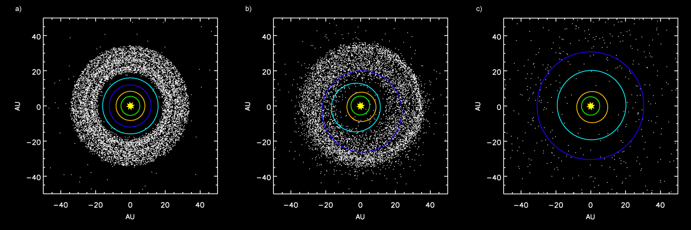
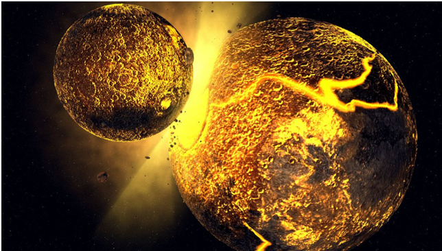
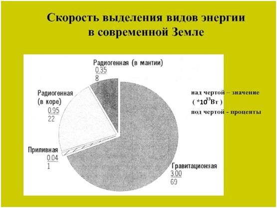
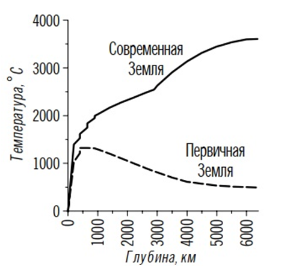
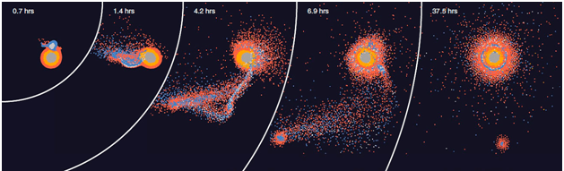
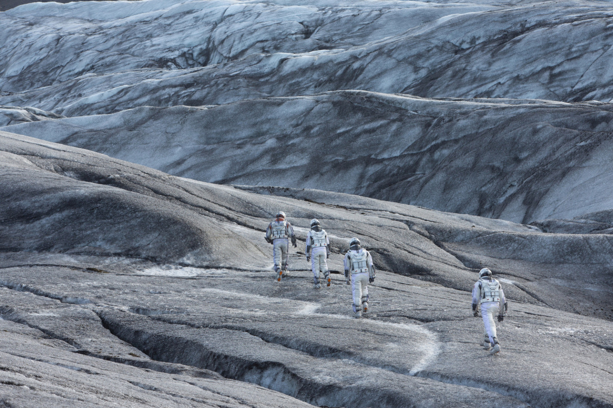
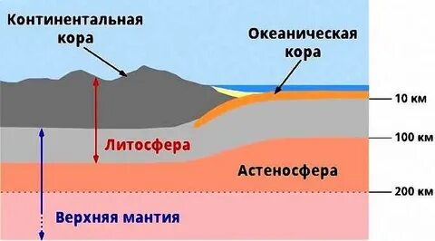
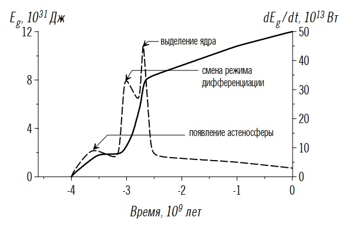
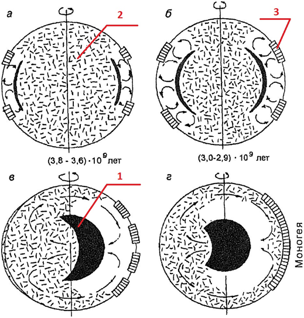

[Ссылка на оригинал статьи](https://habr.com/ru/companies/timeweb/articles/663790/)

# Как появилась Луна, и что из этого вышло

*Автор: [Bodiagnik](https://habr.com/ru/users/Bodiagnik/)*  
*Дата публикации: 30 апр 2022 в 09:43*  
*Время на прочтение: 8 мин*

А также с чего началась земная геология, и почему мы такие особенные в Солнечной системе.

Момент рождения Луны можно для определённости представить как на этом фотоснимке, сделанном 4,5 миллиарда лет назад:

Но можно и усложниться. Дело в том, что тогда Солнечная система была крайне беспокойным местом: во все стороны носились булыжники и планетоиды. Более того, [современные расчёты](https://ru.wikipedia.org/wiki/%D0%9C%D0%BE%D0%B4%D0%B5%D0%BB%D1%8C_%D0%9D%D0%B8%D1%86%D1%86%D1%8B) показывают, что и нынешние наши (тогда ещё прото-)планеты находились на других орбитах, располагались не в том порядке, что сейчас, и, да, Юпитер тоже был не на месте. Всё это дело сталкивалось, меняло орбиты и в конечном итоге падало друг на друга или на Солнце… 

Интересно? Тогда прошу под кат!

*Моделирование, показывающее внешние планеты и пояс планетезималей: a) ранняя конфигурация, орбиты планет по порядку изнутри: Юпитер, Сатурн, Нептун, Уран; b) рассеяние планетезималей во внутреннюю Солнечную систему после изменения орбиты Нептуна (темно-синий) и Урана (голубой) — как раз время тяжёлой метеоритной бомбардировки; c) после того, как планетезимали выброшены из Солнечной системы после взаимодействия с планетами — спасибо Wiki за инфу*

Малая доля каменюк осталась в виде пояса астероидов между Юпитером и Марсом, а также в точках Лагранжа планет-гигантов (может и у планет попроще есть такие «троянцы», да только кому они интересны). Большая часть астероидов была выброшена во внешнюю часть Солнечной системы — в нынешний пояс Койпера и облако Орта — и, поверьте, там есть немало **настоящих** планет, ждущих своего открытия.

Ну а мы перенесёмся на тогда ещё безгрешную Землю – как раз в эти времена переживающую весьма бурный этап своей жизни. Например, тогда по касательной в «нас» врезалась вполне себе планета размером с Марс. На всякий случай ей даже придумали имя – Тея (то, что было Землёй до удара называют Гея). Часть вещества обеих планет выбросило в космос ~~с концами~~ на скорости, превышающей вторую космическую для той системы. Ещё часть упала на Землю. Есть предположения, что комок вещества от Теи до сих пор болтается в мантии Земли в виде огромной сейсмической аномалии (см [мою прошлую статью](https://habr.com/ru/company/timeweb/blog/656477/)).

*Вот пруф*

Самое интересное получилось с тем веществом, что набрало скорость повыше первой космической (7,91 км/с) и поменьше второй (11,2км/с ). Оно образовало кольцевое облако на околоземной орбите. Из этого облака за весьма короткий срок сконденсировалась наша Луна. Она же помогла расчистить пространство у Земли от всякой мелочи типа марсианских Фобосов и Деймосов. Вообще Луна получилась настолько крупной, что вполне справедливо считать нас двойной планетной системой. И вот тут начинается уже земная геология, причём, не имеющая аналогов в Солнечной системе. Начнём с того, что наша «твердь» невероятно подвижна, и движения эти очень и очень необычные.

Отмечу, что сценариев движухи может быть сколько угодно – главное, чтобы хватало энергии для подобного процесса. В общем, без расчетов не обойтись.

### Энергетика и энерговыделение Земли

**Сейчас** выделение тепловой энергии складывается примерно так:

69% – энергия гравитационной дифференциации, около 30 % – радиогенная энергия. Вторая складывается из 22% выделяющихся в коре и 8% – в мантии. Важно понимать, что радиогенная энергия от распада радиоактивных элементов выделяется в основном в континентальной коре, богатой кремнием, алюминием, калием и прочими элементами, с которыми «дружат», образуя устойчивые минеральные образования, ураны, тории и всё что вместе с ними. 

В мантии, в которой калиев и кремниев немного, а железа и магния, наоборот, с избытком, концентрация радиоактивных изотопов раз в двести меньше, так как химически они плохо совместимы. Вся эта хитрая взаимосвязь приводит к тому, что радиогенное тепло выделяется в основном в верхних слоях планеты, быстро рассеивается в космос и никак не влияет на прогрев глубинных частей. Понятно, что в далёком прошлом радиогенное тепло выделялось сильнее, так как нераспавшихся изотопов в тот момент было больше, но и рассеивалось оно тоже быстрее.

Ну а теперь самое интересное! Вспоминаем тот самый 1 (один) процент энергии, выделяемый за счёт приливного взаимодействия в системе Земля – Луна. Луна приливными силами жамкает Землю, внутренним трением разогревая её – как проволоку, которую гнут в разные стороны, чтоб сломать. Сейчас высота твёрдых приливов в земной коре – первые сантиметры, Луна на расстоянии от нас почти 400 тыс. км. И, как мы помним из [первой статьи](https://habr.com/ru/company/timeweb/blog/656477/), мееедленно отдаляется. Но что же было, когда Луна была близко? Земля вертелась быстрее, старики были моложе, а пиво вкуснее? 

Теперь самое интересное! То, что выводится не прямыми измерениями, а расчётами и моделями. Ну всё, как мы любим!

«ИНТРИГИ! СКАНДАЛЫ! РАССЛЕДОВАНИЯ!»

Собственно, 4,5 млрд. лет назад Земля набрала основную массу, но структура её была в целом однородна и хаотична (без дифференциации вещества по плотности). Планета в своей массе не была расплавленной, а скорее тёплой от первоначальной гравитационной энергии. Поверхность постоянно разогревалась ударами метеоритов, но также быстро отдавала тепло в космос. Учитывая всё это, получаем такую картинку распределения тепла в ранней Земле:

*Без всяких дополнительных усилий у нас образуется слой повышенного прогрева на глубинах 50-500 км – потом это будет важно. *

Так бы это всё и шло потихоньку, как на Марсе-Меркурии и прочих Венерах: медленное расслоение на лёгкие и тяжёлые оболочки, выделение железного ядра с медленным же и слабым разогревом, а потом чахлым остыванием без нормального магнитного поля. И всё это без перспектив на вершину вселенской эволюции – «рюмки коньяка с ломтиком лимона» – по версии Стругацких. Но вдруг! Жахнуло! Тея влетела в нас и понеслось.

*Результаты моделирования одного из возможных вариантов столкновения*

Молодая Луна, быстро вращаясь весьма близко к Земле, поднимала на планете приливные горбы высотой около 2 (двух) километров (километров). Наш естественный спутник таким образом расходовал на это энергию вращения пары Земля-Луна, замедлял Землю, и удалялся от неё.

С наибольшей интенсивностью приливная энергия выделялась в Земле в самом начале ее геологического развития. Сразу же после появления Луны около 4,6 млрд лет назад скорость выделения приливной энергии, согласно расчетам, достигала гигантской величины – около 1,4х1017 Вт, что в 3000 (!) раз превышает скорость генерации всей эндогенной энергии в современной Земле. Тектоническая активность в этот период также была необычайно высокой, хотя и весьма специфической: каждые лунные сутки вдоль экватора, обращенного к Луне, Землю обходил двухкилометровый приливный горб.

*Типа как в кино «Интерстеллар», только потвёрже, пожалуй. Ну и потеплее градусов на 500*

Поскольку молодая Земля в то время еще не была дифференцирована и у нее отсутствовала астеносфера, то приливная энергия более или менее равномерно распределялась по большей части массы Земли и целиком уходила на ее разогрев. В результате только за счет приливного взаимодействия с Луной Земля могла дополнительно прогреться примерно на 500°С.

Процесс затухал шёл по уменьшающейся экспоненте. За несколько десятков миллионов лет он опустился в нашем воображаемом энергорейтинге с ведущих ролей до нынешнего 1 %. Когда прошёл пик энерговыделения приливной энергии (3,8 – 4 млрд. лет назад), земная кора перестала взбиваться в гоголь-моголь.

*Такой*

**Кстати, в Интерстелларе же была и другая планета, как раз с похожей структурой**

С этого момента начинается нормальная геология, которую мы можем увидеть и пощупать на поверхности Земли.

### Появление астеносферы и «нормальная геология»

*Астеносфера — слой в верхней мантии планеты. Более пластична, чем соседние слои. Это даёт возможность блокам литосферы двигаться по ней, а также обеспечивает изостатическое равновесие этих блоков.*

Основное энерговыделение Земли от приливных взаимодействий шло в верхних слоях Земли: с поверхности тепло быстро рассеивалось, а на глубине первых сотен километров накапливалось. Так образовалась первая астеносфера, ещё далеко не всепланетная – скорее экваториальный пояс разогретых, частично расплавленных пород. Что интересно, образование пластичной астеносферы привело к быстрому рассеиванию приливной энергии и мощному импульсу отодвигания Луны от нас. Ну и, соответственно, произошло резкое падение выделения приливной энергии. В свою очередь ускорение отодвигания Луны от нас дало старт эпохе интенсивного проявления базальтового магматизма там. А также появление астеносферы обусловило начало процесса дифференциации земного вещества и начало тектонической активности Земли.

*График выделения энергии в Земле

Сплошная линия – суммарная энергия, пунктирная – скорость выделения энергии*

Дальше совершенно логично и неизбежно в этом астеносферном слое началось конвективное движение и гравитационное разделение вещества. 

В первичной Земле содержание железа было более-менее равномерно и гораздо выше, чем в нынешней коре и даже в мантии, а потому процесс дифференциации вещества развивался весьма энергично. Это даёт нам первый пик энерговыделения на графике. В районе 3,5 млрд. лет назад.

Ещё полмиллиарда лет всё шло по накатанной. В это время происходила дегазация планеты – выделялись водороды фторы и аргоны, но для нас главное – свободный кислород! Он резко повышает скорость выплавки и выделения железа из первичного вещества. А с этим и скорость выделения тепла при дифференциации в первичной астеносфере. Когда его выделилось много, процесс плавки железа сильно упростился. Гравитационное разделение вещества планеты и выход энергии ускорились. Это нам даёт второй, гораздо более высокий пик на графике, около 3 млрд. лет назад.

### Запуск глобальной конвекции

А дальше случилось… в общем, смотрите:

В первичной астеносфере образовалась глобальная гравитационная неустойчивость – тяжелое обогащённое железом вещество в нижней части астеносферы лежало на заметно более лёгком веществе первичной земли. Понятно, что долго швабра на кончике ручки не простоит. Так и с этим тяжёлым слоем. В какой-то момент неустойчивость схлопнулась – это было, пожалуй, самое грандиозное событие в жизни планеты! Хотя на поверхности скорее всего это отражалось весьма умерено. По сути, Земля внутри себя вывернулась наизнанку! Появился глобальный поток проваливающегося к центру земли тяжёлого вещества и обратный поток вытесняемого\всплывающего лёгкого вещества.

*Последовательные этапы развития (а—г) процесса зонной дифференциации земного вещества и формирования плотного ядра Земли

1— расплавы железа и его окислов; 2 — первичное земное вещество; З — континентальные массивы*

Представляется весьма вероятным, что именно таким путём у Земли началось формирование плотного ядра. Причем, раз начавшись, процесс должен был развиваться лавинообразно и достаточно быстро, поскольку тогда, 2,9—2,8 млрд лет назад, разность плотности между ”ядерным” и первичным земным веществом достигала 3—3,5 г/см, а к концу архея в кольцевой зоне дифференциации уже скопилась большая масса тяжелых окисно-железных расплавов. Скорость развития этого процесса тогда сдерживалась только высокой вязкостью первичного вещества бывшей земной сердцевины, растекавшегося по активному поясу верхней мантии под влиянием гигантских избыточных давлений, действовавших на эту сердцевину со стороны формировавшегося тогда ядра Земли. Тем не менее, вероятно, что весь процесс формирования земного ядра по описанному сценарию занял не более 100—200 млн лет.

После выделения железистого ядра, его разогрева и частичного плавления стала возможной генерация мощного магнитного поля. Это сильнейшим образом сказалось на развитии жизни: поле защищало её от жёсткого космического и солнечного излучения. Заодно геомагнитное поле не давало солнечному ветру уносить нашу атмосферу, как это происходит на Марсе.

Внутри же планеты зародился всеобщий поток вещества. Над нисходящей ветвью этого глобального потока первые литосферные плиты собрались в первый мегаконтинент, над восходящей началось формирование океанской коры современного типа. Весь процесс сопровождался сильнейшим скачком выделения энергии, разогревом и понижением вязкости вещества планеты.

Это был первый глобальный конвективный процесс на Земле. Он запустил всю дальнейшую эволюцию Земли, которая сделала её столь непохожей на остальные планеты Солнечной системы. Так что можно смело утверждать, что без вмешательства сил извне (я имею в виду Тею) нас с вами и не было бы. Такие дела.

**Источники**

«Геодинамика» С.В. Аплонов. Издательство С.-Петербургского университета 2001

«Океанический рифтогенез» Е.П. Дубинин С.А. Ушаков Москва ГЕОС 2001

«Земля. Введение в общую геологию». Дж. Ферхуген, Ф. Тернер, Л. Вейс, К. Вархафтиг, У. Файф. (Перевод с английского Ю. П. Алешко-Ожевского, Р. М. Минеевой, Г. Н. Мухитдинова, П. П. Смолина. «МИР» 1974

[tags:space]
