[Ссылка на оригинал статьи](https://habr.com/ru/companies/timeweb/articles/676052/)

# Астероидная опасность

*Автор: [lozga](https://habr.com/ru/users/lozga/)*  
*Дата публикации: 10 июл 2022 в 09:00*  
*Время на прочтение: 10 мин*

Несколько раз в год мы узнаем из СМИ пугающие новости — астероид со страшным номером вот-вот сблизится с Землей на опасное расстояние. Обещанный день наступает, катастрофы не происходит, про пролет в лучшем случае рассказывают на профильных астрономических сайтах, а мейнстримные СМИ про него уже давно забыли, и в особенно веселых случаях успели за прошедшее время выпустить еще несколько аналогичных кликбейтных пугалок. С 2015 года человечество отмечает 30 июня как “День астероида”, целью которого является в том числе и просвещение в вопросах астероидной опасности, чем мы с вами в этом материале и займемся.

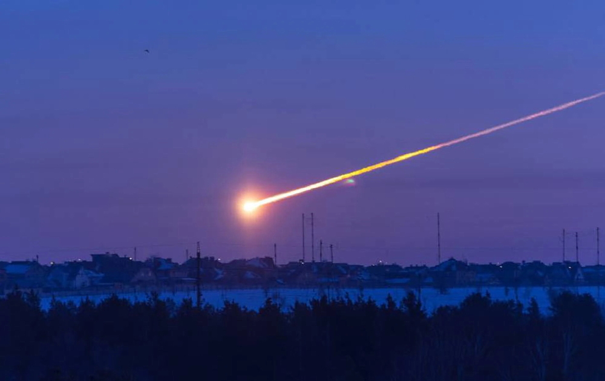

*Падение Челябинского метеорита*

Для желающих, видео лекции.

[Видео лекции на YouTube](https://www.youtube.com/watch?v=mI3fTJ_bAKM)

## Происхождение

Дата 30 июня была выбрана не случайно — именно в этот день в 1908 году в районе реки Подкаменная Тунгуска произошел феномен, чаще всего называемый Тунгусским метеоритом. Такую витиеватую формулировку приходится использовать, потому что достоверных обломков метеорита до сих пор не нашли. По словам находившегося в 70 километрах свидетеля Семена Семенова, событие выглядело следующим образом:

> "…Вдруг на севере небо раздвоилось, и в нём широко и высоко над лесом появился огонь, который охватил всю северную часть неба. В этот момент мне стало так горячо, словно на мне загорелась рубашка. Я хотел разорвать и сбросить с себя рубашку, но небо захлопнулось, и раздался сильный удар. Меня сбросило с крыльца метров на шесть. После удара пошел такой стук, словно с неба падали камни или стреляли из пушек, земля дрожала, и когда я лежал на земле, то прижимал голову, опасаясь, чтобы камни не проломили голову. В тот момент, когда раскрылось небо, с севера пронесся горячий ветер, как из пушки, который оставил на земле следы в виде дорожек. Потом оказалось, что многие стёкла в окнах выбиты, а у амбара переломило железную закладку для замка двери."

Достоверно известно, что некое небесное тело вошло в атмосферу Земли и произвело взрыв, который был слышен за 800 км от эпицентра, а сейсмическую волну зафиксировали станции вплоть до города Йена в Германии.

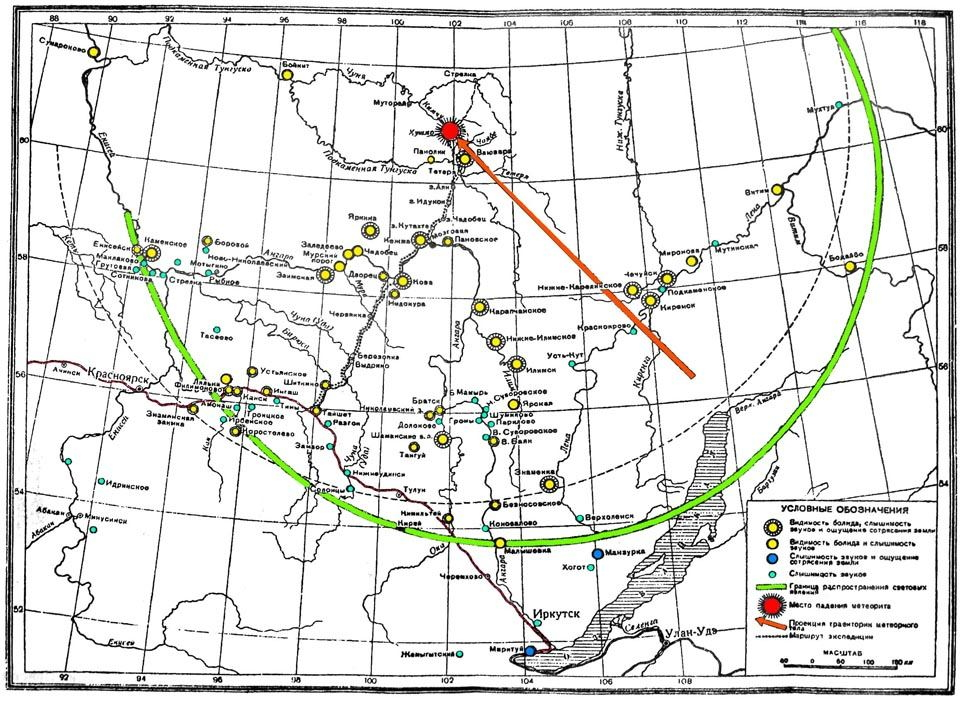

*Одна из возможных траекторий движения тела, желтое — световые явления, зеленое — слышимость звуков, синее — звуки и сотрясение земли*

В 1921-39 годах советский минералог Леонид Кулик возглавил пять экспедиций в район феномена. По сохранившимся поваленным деревьям рассчитали район взрыва, но образцов метеорита найти не удалось. В последующие годы там работали и другие экспедиции. Отсутствие найденных образцов метеорита привело к тому, что феномен объясняется самыми разными гипотезами. По одной из них, небесное тело вошло в атмосферу под очень маленьким углом и либо улетело обратно в космос, либо же обломки выпали в сотнях, а то и тысячах километров от места взрыва. Популярной версией остается гипотеза разрушившегося на очень мелкие обломки каменного метеорита. Еще один вариант — кометное ядро, состоящее главным образом из льда и не способное поэтому оставить большого количества заметных следов. А дальше идут все более фантастические гипотезы — метеорит из антивещества, корабль инопланетян, корабль инопланетян, движущихся во времени в обратную сторону, отправленный в прошлое котенок и так далее. Одно время тайна Тунгусского феномена была очень модной и популярной, в СССР большим сторонником гипотезы атомного взрыва корабля инопланетян был известный фантаст Александр Казанцев. Мода закономерно сменилась усталостью, и редакции стали указывать в требованиях к присылаемым рукописям, что “произведения о тайне Тунгусского метеорита не принимаются”. 

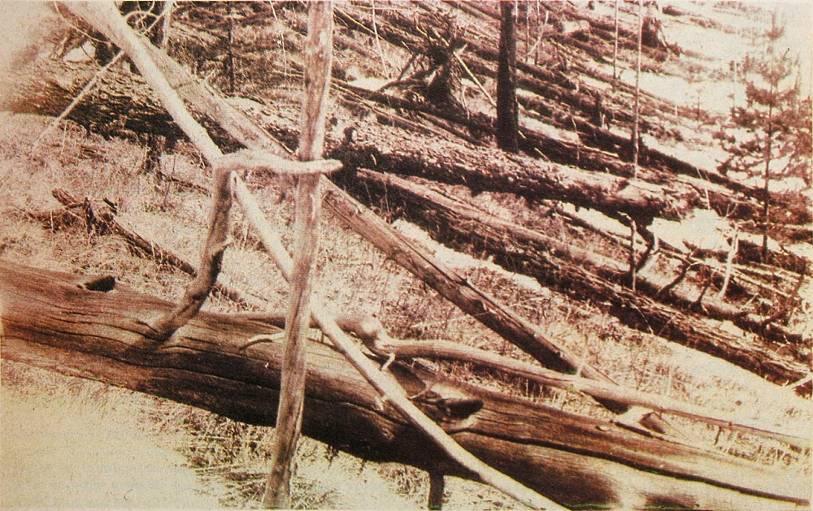

*Поваленные деревья, фото экспедиции Леонида Кулика, 1929*

Из-за малого количества достоверно известной информации характеристики Тунгусского феномена даются с большой неопределенностью. Размер тела оценивают в 50-80 метров. Высоту взрыва — 5-10 км, а мощность от 3 до 50 мегатонн. Здесь стоит сделать ремарку, что мощность взрывов разрушающихся в атмосфере астероидов удобно сравнивать с ядерным оружием. В обоих случаях выделяется большое количество энергии за короткое время, но в случае астероида этот процесс может происходить несколько медленнее, и, конечно, нет ни проникающей радиации, ни радиационного загрязнения местности. Для сравнения, тяжелая моноблочная боеголовка W53, стоявшая на МБР Titan II, имела мощность 9 Мт, а самый мощный испытательный ядерный взрыв, [советская “Царь-бомба”](https://www.youtube.com/watch?v=lfi0zYoqCY0) — 50 Мт.

## Очень наглядно

В 21 веке логично ждать падения интереса к Тунгусскому феномену по причине того, что аналогичное, но меньшего масштаба событие произошло в густонаселенной территории, где не были законодательно запрещены видеорегистраторы. Как вы легко догадались — это падение Челябинского метеорита 15 февраля 2013 года.

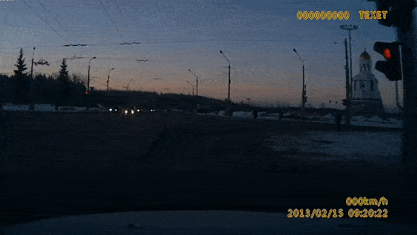

На [многочисленных кадрах](https://www.youtube.com/watch?v=mebWfDlhcRs) мы видим то же самое, что рассказывал Семен Семенов. След метеорита разрезает небо надвое, огонь охватывает часть неба, мощное световое излучение воспринимается как тепло, а потом приходит ударная волна.

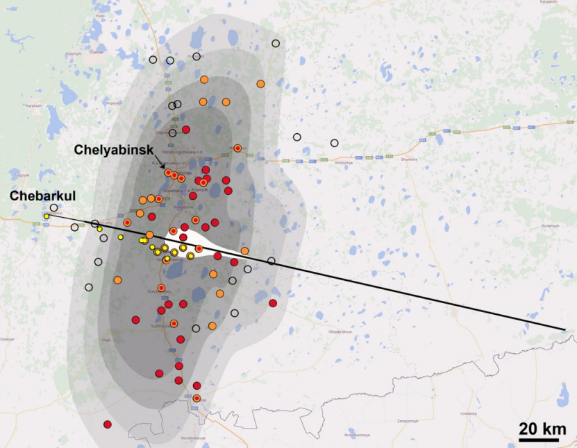

*Чем темнее зона, тем сильнее ударная волна. Ширина белой зоны — яркость свечения. Желтые точки — обнаруженные обломки. Оранжевый и красный — повреждения домов. Пустые кружки — отсутствие повреждений. [Источник](https://www.researchgate.net/publication/259288892_Chelyabinsk_Airburst_Damage_Assessment_Meteorite_Recovery_and_Characterization)*

Из-за огромного количества свидетельств, траектория движения тела была установлена очень точно. Также, благодаря тому, что была зима, было еще легче обнаруживать обломки — мелкие лежали прямо на снегу, покрупнее нарушали снежный покров, а большая полынья в озере Чебаркуль показывала место падения самого крупного обломка массой 570 кг. Если бы первая экспедиция прибыла на место только спустя 13 лет, можно было бы и не найти ничего, кроме поваленных деревьев.

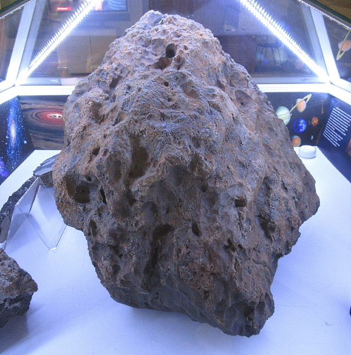

*Фрагмент метеорита Челябинск в Государственном историческом музее Южного Урала, фото Lumaca/Wikimedia Commons*

Челябинский метеорит оказался редким подтипом LL5 самого распространенного (~85% всех находок) вида каменных метеоритов — обыкновенных хондритов. На момент входа в атмосферу его диаметр оценивают в 20 метров, массу — в 12 тысяч тонн. На высоте от 50 до 30 км он разрушился, выделив при этом энергию, оцениваемую от 100 до 500 килотонн. Для сравнения — это типичный заряд в разделяющихся боеголовках современных ракет — у единственной на сегодняшний день модели шахтной МБР США Minuteman III до 3 боеголовок мощностью 350 кт, у новой российской МБР “Сармат” до 12 боеголовок мощностью 750 кт. Для еще большей наглядности, вот [видео взрыва 500 кт](https://www.youtube.com/watch?v=O69Kc1i01tA) в рамках испытаний Ivy King 1952 года.

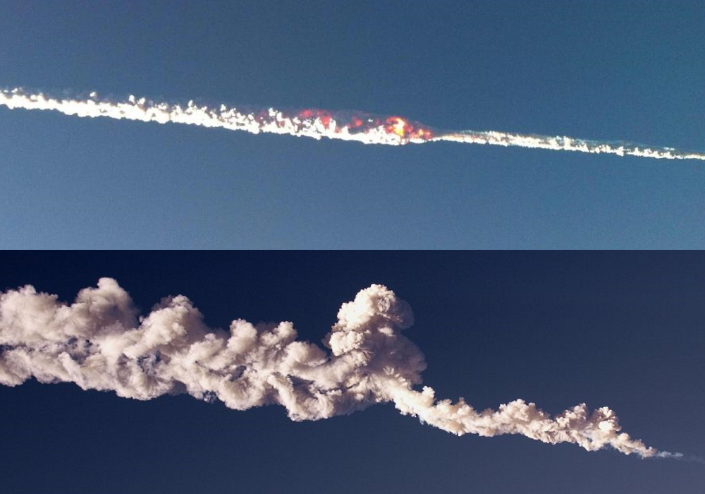

*Фото очевидцев в момент падения и спустя некоторое время*

Несмотря на выделение энергии, сравнимой с ядерной боеголовкой, никто не погиб. Количество пострадавших оценивается в 1500 человек, от ударной волны рухнула крыша цинкового завода и было выбито огромное количество оконных стекол, в целом ущерба насчитали на миллиард рублей, но это весьма небольшие повреждения. Анекдотический случай — непосредственно от падения обломков метеорита пострадала только хозяйственная пристройка, у которой с краю крыши небольшой кусок выщербил шифер. На высоте десятков км атмосфера очень разреженная, что ослабляет ударную волну (именно поэтому реальные ядерные боеголовки кроме специальных случаев подрывают над целью, но невысоко) к тому же у Челябинского метеорита интенсивное разрушение заняло несколько секунд, и в нем выделяют три отдельные вспышки (т.е. моменты большего выделения энергии).

## Опасность в цифрах

Конечно же, падение Челябинского метеорита вызвало повышенный интерес к опасности от астероидов. Именно из-за него, например, в 2013 году был активирован переведенный в спящий режим инфракрасный орбитальный телескоп WISE, сейчас известный по имени ведущейся программы NEOWISE. Обсерватория нашла тысячи околоземных астероидов и продолжает работу.

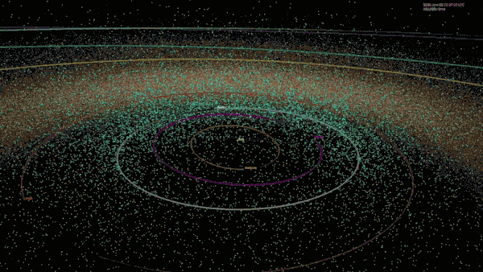

*Околоземные астероиды на 2018 год, анимация NASA*

Вы вполне могли видеть иллюстрации околоземных астероидов вроде анимации выше. Она может показаться страшной на вид, но этот эффект создается исключительно за счет масштаба — на гифке изображена вся внутренняя Солнечная система, от центра, где Солнце, до нижней границы, которая примерно в районе орбиты Марса, 12,5 световых минут. Если же посмотреть на цифры более внимательно, то очень полезной будет [инфографика](https://www.esa.int/ESA_Multimedia/Images/2018/06/Asteroid_danger_explained) от Европейского космического агентства (в одной картинке все самое важное об астероидной опасности, поэтому я ее разрежу на части и буду долго комментировать).

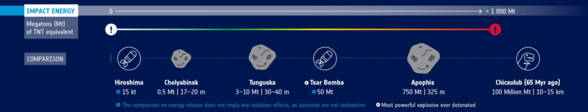

Прежде всего, как размер астероида связан с его опасностью? На всякий случай напомню, что сравнение с атомным взрывом неплохо показывает общее выделение энергии, но вот реальные повреждения будут меньше. Челябинский метеорит по мощности заметно больше, чем Хиросима, но разрушения от него и близко не похожи. Самое интересное находится в правой части шкалы. Астероид Апофис долгое время был притчей во языцех, потому что достаточно велик, чтобы устроить серьезное бедствие — мощность его взрыва сравнима с общей мощностью всех ядерных испытаний человечества. Долгое время считалось, что его сближения с Землей в 2029 и 2036 потенциально опасны, однако уточнение орбиты обещает, что в 2029 году он пролетит ближе геостационарных спутников, но все-таки мимо, и в настоящее время он не считается опасным. А на самой правой границе шкалы лежит событие, оставившее невидимый даже из космоса и обнаруженный случайно [кратер Чикшулуб](https://ru.wikipedia.org/wiki/%D0%A7%D0%B8%D0%BA%D1%88%D1%83%D0%BB%D1%83%D0%B1_(%D0%BA%D1%80%D0%B0%D1%82%D0%B5%D1%80)) диаметром 180 км. Он считается результатом падения тела диаметром 10-15 км, которое, возможно, привело к вымиранию динозавров. Тротиловый эквивалент 100 тератонн сложно представить, но по современным научным представлениям это цунами высотой 50-100 метров, пожары по всей планете, уничтожившие 70% лесов, массовая и очень быстрая гибель всего живого на расстоянии 2500 км от места падения и настоящая ядерная зима на несколько лет. Впрочем, несмотря на массовое вымирание, это же событие является началом кайнозойской эры, в которой мы с вами живем, и не такие уж далекие родственники динозавров, крокодилы, сегодня живут и здравствуют.

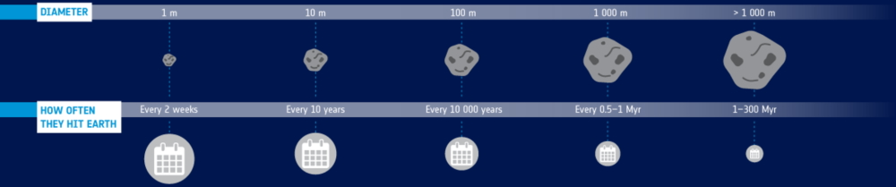

Следующая хорошая новость заключается в том, что с увеличением размера частота падения астероидов не просто убывает, а убывает экспоненциально. [Метеороид](https://ru.wikipedia.org/wiki/%D0%9C%D0%B5%D1%82%D0%B5%D0%BE%D1%80%D0%BE%D0%B8%D0%B4) диаметром 10 метров врезается в атмосферу не в десять раз реже, нежели диаметром 1 метр, а в 260 раз. А гости из космоса диаметром 100 метров прилетают примерно раз в 10 тысяч лет.

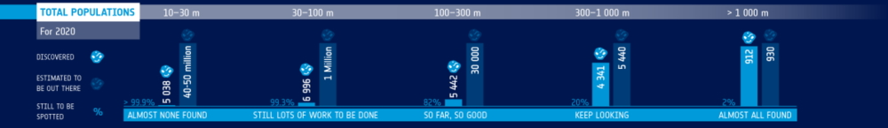

А самая хорошая новость заключается в том, что чем больше и опаснее астероид, тем лучше его видно и тем больше вероятность, что человечество уже его нашло и с разной точностью знает его орбиту и степень опасности. Тела диаметром более километра найдены почти все, их популяция оценивается в 930 штук и осталось найти всего 18. Но вот в диапазоне от Челябинского до Тунгусского метеоритов найдено только 0,7% популяции, и здесь еще предстоит много работать.

## Плоды прогресса

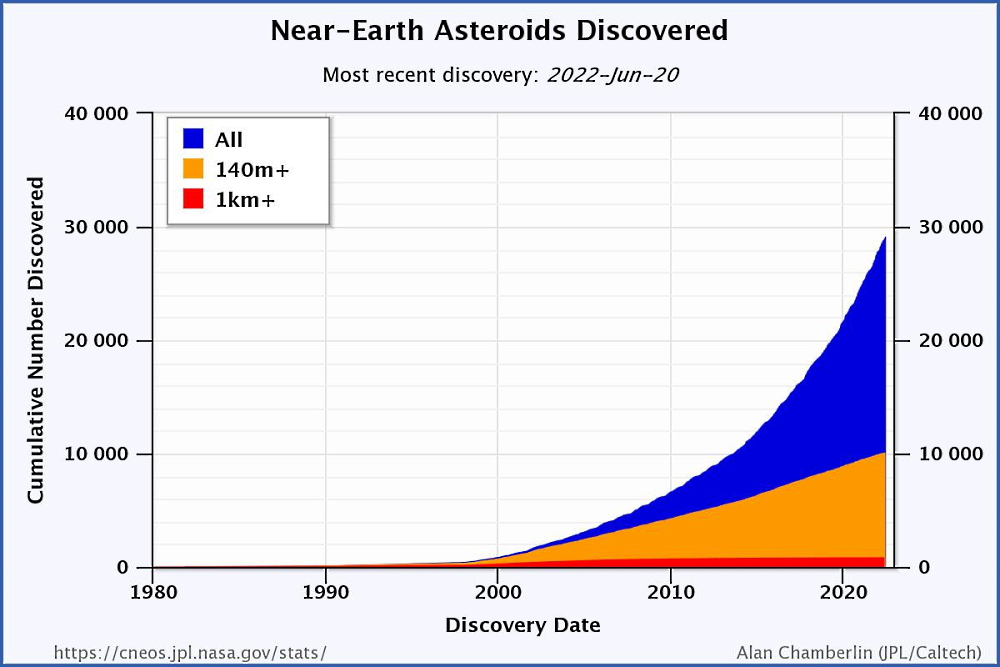

*График Центра изучения околоземных объектов NASA/JPL*

Еще одна очень позитивная новость выводится из наклона кривой общего количества найденных околоземных объектов. То, что график загибается вверх, говорит о том, что и выделенные ресурсы на поиск, и технический прогресс в средствах поиска позволяют находить все больше околоземных астероидов в год. Поиск потенциально опасных астероидов ведется [более чем десятком проектов](https://en.wikipedia.org/wiki/List_of_near-Earth_object_observation_projects), среди которых и наземные, и орбитальные аппараты. Европейское космическое агентство планирует построить широкоугольный телескоп [NEOSTEL](https://www.esa.int/Space_Safety/Flyeye_ESA_s_bug-eyed_asteroid_hunter), из-за особенностей конструкции известный как Flyeye (“Фасетчатый” или “Мушиный глаз”). В NASA разрабатывается орбитальный инфракрасный телескоп [NEO Surveyor](https://en.wikipedia.org/wiki/NEO_Surveyor) на замену NEOWISE.

Большое количество наблюдателей и их связь в единую сеть позволяют добиваться весьма впечатляющих результатов: в марте 2022 года был обнаружен уже пятый астероид до его падения на Землю. 11 марта в 19:24 UTC Кристиан Шарнецкий (Krisztián Sárneczky), учитель географии и охотник за астероидами, заметил на своих снимках новый движущийся околоземный объект. В 19:38 он сообщил о находке в Центр малых планет, добавив второй набор данных о наблюдении в 20:16. Сначала вероятность столкновения была оценена в 1%, однако в 20:25 система Meerkat Европейского космического агентства подняла тревогу — рассчитанные более точно параметры орбиты тела указывали на неизбежность столкновения. Несмотря на сложности поиска тела, которое было уже ближе 50 тысяч километров от Земли и быстро перемещалось по небу, подключились дополнительные наблюдатели. Оказалось, что это метеороид диаметром примерно 1 метр, который должен войти в атмосферу в районе Исландии в 21:22. Так и произошло — вспышку зафиксировали камеры в Норвегии, а падение подтвердила сеть инфразвуковых детекторов.

В то же время эта история — пока что скорее счастливое исключение. Ожидаемые события и возможности при обнаружении потенциально опасного объекта были [показаны в рамках “учений”](https://blogs.esa.int/rocketscience/2021/04/26/deep-fake-impact/) на Конференции по защите от астероидов (Planetary Defence Conference) 2021. В первый день информация весьма скупа — новое тело PDC 2021 имеет шанс столкнуться с Землей 1/2500 через полгода, а его размеры оцениваются от 35 до 750 метров. На следующий день вероятность столкновения растет до 5%, а размер остается настолько же неопределенным. Новый день “учений” и конференции виртуально перемещается вперед во времени — вероятность возросла до 100%.

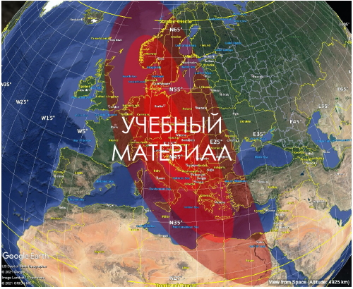

*Учебный район падения астероида. Иллюстрации с конференции несут на себе крупные надписи EXERCISE во избежание нездоровых сенсаций*

Участники конференции быстро пришли к выводу, что космическую миссию в обозначенные сроки запустить невозможно, а находящихся в высокой степени готовности сил и средств противоастероидной обороны у человечества нет. Новые дни конференции и “учений” предоставляли новую информацию, но всегда позже, чем было нужно. Общий вывод учений, по результатам которых астероид оказался диаметром 105 м и упал на границе Чехии, Австрии и Германии, вызвав серьезные разрушения в круге диаметром до 300 км — для успешного отражения подобного небесного тела нужно и больше информации, и долговременное планирование, и учения по аналогичному сценарию с участием государственных органов, чтобы принимающие решения лица осознали, что планирование ежегодного бюджета несовместимо с мероприятиями по защите от астероида, который обнаруживается за полгода до падения.

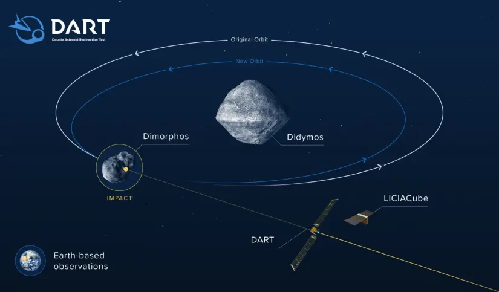

*Миссия DART, иллюстрация NASA*

Говоря о достижениях прогресса нельзя не упомянуть запущенную в прошлом году миссию DART — Испытание Изменения Орбиты Двойного Астероида (Double Asteroid Redirection Test). В конце сентября этого года [импактор](https://lozga.livejournal.com/255801.html) DART должен будет врезаться в астероид Диморф, вращающийся вокруг астероида Дидим. Столкновение кроме ожидаемо [шикарных кадров космического бабаха](https://ic.pics.livejournal.com/lozga/3516068/1591676/1591676_original.gif), должно будет изменить орбитальную скорость Диморфа на 4 мм/с, а период обращения уменьшить на 10 минут. Цель миссии — проверить, насколько предсказанные цифры сойдутся с реальными, это позволит точнее рассчитывать массу импактора на случай появления действительно опасного астероида.

## Торино и Палермо

Человечество разработало целых две шкалы, чтобы оценить степень опасности астероида. Первая из них, шкала Торино (или Туринская), связывает кинетическую энергию столкновения и его вероятность в простой таблице.

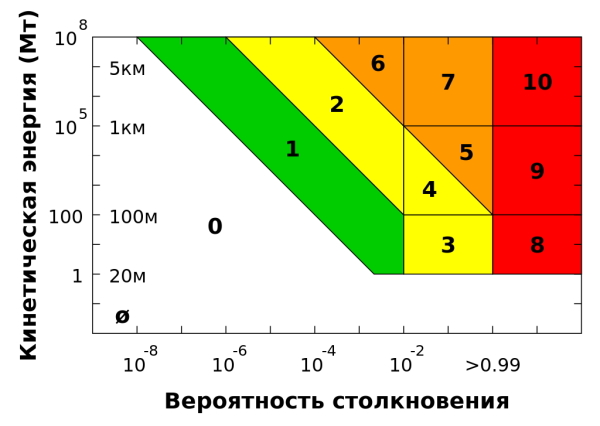

*Шкала Торино, иллюстрация Kosmos24/Wikimedia Commons*

Шкапа Торино очень удобна своей простотой. На сегодняшний день нет ни одного астероида со значением шкалы выше нуля. Исторический рекорд принадлежит астероиду Апофис, получившему значение 4, однако последующие наблюдения, исключившие вероятность столкновения в этом веке, привели к тому, что и у него теперь 0 баллов.

Альтернативная шкала, Палермо, использует [логарифм от двухэтажной формулы](https://ru.wikipedia.org/wiki/%D0%9F%D0%B0%D0%BB%D0%B5%D1%80%D0%BC%D1%81%D0%BA%D0%B0%D1%8F_%D1%88%D0%BA%D0%B0%D0%BB%D0%B0), но удобна тем, что позволяет отсортировать все объекты по убыванию степени риска. В ней объекты с оцененным риском -2 фактически не представляют опасности, диапазон от -2 до 0 требует тщательного мониторинга, а Апофис когда-то имел оценку в 1,10.

## Заключение

Если вы слышите в СМИ сообщение о том, что вот-вот упадет страшный астероид, самое разумное — это открыть сайт [Центра околоземных объектов NASA](https://cneos.jpl.nasa.gov/sentry/) или [Координационного центра околоземных объектов ЕКА](https://neo.ssa.esa.int/risk-list) и поискать там упомянутый астероид. Роскосмос таких удобных таблиц пока не предоставляет, но они уже начали комментировать появляющиеся новости проверкой траектории тела своими средствами. Обычно это простое действие очень успокаивает — или камешек оказывается мелкий, или дата потенциального сближения в середине тысячелетия, или вероятность столкновения до смешного мала, или же все вместе взятое. В общем же, несмотря на то, что тело размером с Челябинский метеорит все еще может прилететь внезапно, крупные астероиды в большинстве своем уже найдены, и человечество активно и успешно ведет работу, чтобы найти и каталогизировать потенциально опасные объекты.

[tags:space]
